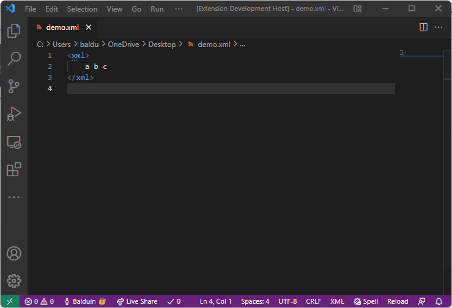
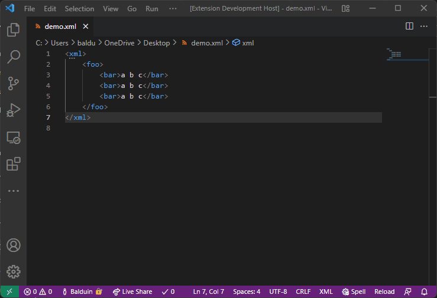

# surround-with-tag README

VS Code Extension "surround-with-tag"

## Features

This Extension provides simple functionality to surround any activated text/elements with a HTML/XML tag.

First, select some text in the editor. Then in the Command Palette (`Ctrl + Shift + P`), type "Surround with Tag" - or simply hit `Ctrl + I`/`Cmd + I`. This will prompt a window, where you can type in the tag name. The opening and closing tags get inserted before and after the initial text selection.


The extension also supports basic [Emmet abbreviations](https://docs.emmet.io/abbreviations/). Given an XML file:

```XML
<xml>
    foo
</xml>
```

If `foo` is selected and the `Surround with Tag` command is executed with the following input: `b>ar*3`. The following output will be generated:

```XML
<xml>
    <b>
        <ar>foo</ar>
        <ar>foo</ar>
        <ar>foo</ar>
    </b>
</xml>
```



The extension supports multi-selections.



Note however that a combination of multi-selection and emmet abbreviations may end up with unexpected results.


## Extension Settings

* `extension.surroundWithTag` (Command): Prompt surrounding with tag (Keybind: `Ctrl + I`)

## Known Issues

None so far.

The Extension has been tested under Windows 10/11 and MacOS.

Please open an issue on github if you encounter any problems.

## Roadmap

The extension is currently considered feature complete.

Additional features can be requested as ([GitHub issues](https://github.com/BalduinLandolt/vs-code-surround-with-tag/issues)).
If they seem useful and I have time, I will gladly implement them.

## Release Notes

See [Changelog](CHANGELOG.md).
