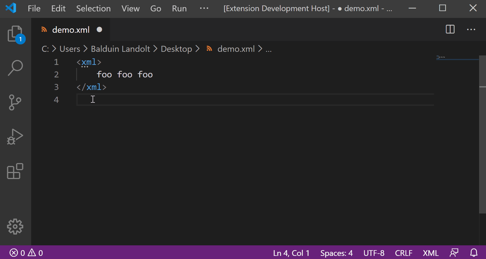

# surround-with-tag README

VS Code Extension "surround-with-tag"

## Features

This Extension provides simple functionality to surround any activated text/elements with a HTML/XML tag.

First, select some text in the editor. Then in the Command Palette (`Ctrl + Shift + P`), type "Surround with Tag" - or simply hit `Ctrl + I`. This will prompt a window, where you can type in the tag name. The opening and closing tags get inserted before and after the initial text selection.

## Requirements

None.

## Extension Settings

TODO: contributes

Include if your extension adds any VS Code settings through the `contributes.configuration` extension point.

For example:

This extension contributes the following settings:

* `myExtension.enable`: enable/disable this extension
* `myExtension.thing`: set to `blah` to do something

## Known Issues

None so far.

Not all features are implemented, though. (See Roadmap below.)

The Extension has been tested under Windows 10. Any feedback on how it runs under Linux/MacOS is appreciated.

Please open an issue on github if you encounter any trouble or have feedback, suggestions or anything of that sort.

## Roadmap

TODO: roadmap

## Release Notes

### 0.1.0 (upcoming)

Initial release. Covers basic functionality. (Upcoming...)
