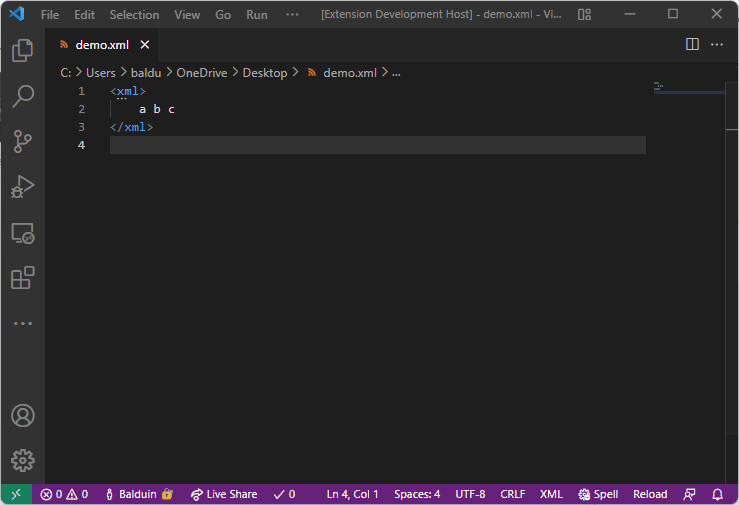
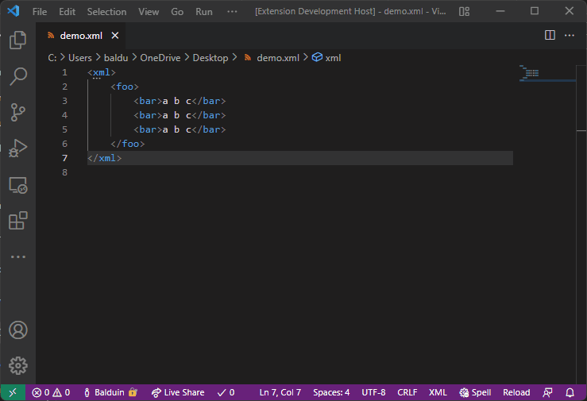

# SurroundWithTag - What's new?

Finally, release 1.0 is here! And it comes with a bunch of improvements:

## 1.0 Release Features
The extension now has a logo on the VSCode Marketplace. (Which proves that I'm a programmer, not an artist.)

Also, a little bug have been fixed. No longer is the closing tag doubled when using the extension with HTML files.

And finally, two major features have been implemented:

### Emmet Annreviation support

You can now use emmet abbreviations to speed up your process even more:

### Multi-Select Support

The extension now supports Visual Studio Code's Multi-Selection capabilities:

Those two features can also be combined for some really wild results.

## Outlook

Where to go from here?

The extension is considered feature complete for now. But if you have a feature request, drop it in the [GitHub issues](https://github.com/BalduinLandolt/vs-code-surround-with-tag/issues) and I'll be happy to consider it.

Stay safe and happy coding!
